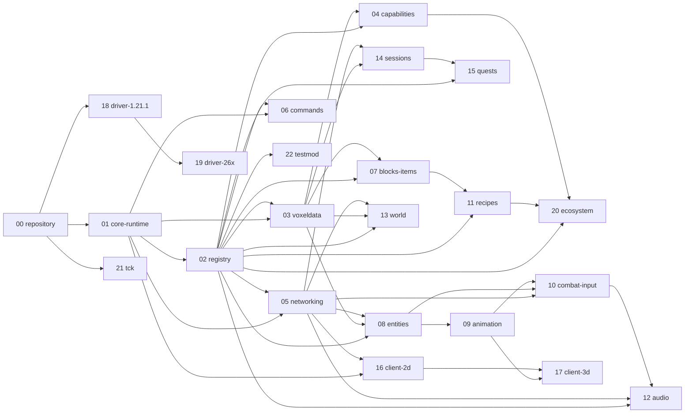

# VINE subsystem plans — agent index

Master plan: [`../vine-engine-plan.md`](../vine-engine-plan.md) — vision,
locked decisions, system design (§-refs below point there). This directory
splits the plan into **22 stage-granular subsystem plans** so AI agents can
read, follow, track, and build subsystems **independently and in parallel**.

## How to work a subsystem (agent loop)

1. Read the master-plan §-refs in your subsystem file's header.
2. Read your subsystem file fully. Check its **Depends on** rows in the
   dashboard below — dependencies must be `done` (or the specific needed stage
   done) before you start.
3. **Claim** by setting your file's `Status:` to `in-progress`. One agent owns
   one file at a time.
4. Execute stages in order; each stage's bootstrap prompt is self-contained.
5. After each stage: run its acceptance check, tick the stage checkbox, commit
   with message `sub-XX: stage <letter> — <name>`.
6. Stuck on something outside your file → `Status: blocked(<reason>)` and
   report. Finished → `done` + update the dashboard row.

## Binding conventions

- **Prime Invariant** and **Minimal Footprint Rule** (plan §5.1). **Mixin
  Quarantine** (§5.9).
- Shared modules (`vine-api`, `vine-client-api`, `vine-core`, `vine-spi`):
  Java 21 bytecode. 26.x drivers: Java 25.
- Package roots: `dev.vineengine.vine` (public API), `dev.vineengine.vine.internal` (SPI/drivers).
- **DFU carve-out:** `com.mojang.serialization` (DataFixerUpper — a standalone,
  version-stable Mojang library, *not* `net.minecraft`) is the one external
  type allowed in `vine-api` signatures; descriptor `Codec`s ride it (§5.1).
- **`@VineUnsafe` mechanics (locked §11.2):** consumer jars using it declare
  `Vine-Unsafe: true` in `MANIFEST.MF`; boot bytecode scan + tooling warn on
  mismatch. **vine-core shading (locked §11.4):** dependencies shaded +
  relocated under `dev.vineengine.internal.shaded`.
- No version conditionals in consumer code; no version-string parsing anywhere
  (feature probes, §5.12).
- Every new surface ships with a TCK scenario on ≥2 drivers, one per loader
  family (§8). No surface merges without it.
- **Acceptance-matrix rule:** pre-M4, "all cells" in any stage acceptance means
  the *current* driver matrix (the two 1.21.1 cells); post-M4 it means all
  four. Stages may note a deferred 26.x re-run instead of blocking on M4.
- Skip project-wide formatters/linters unless a stage explicitly says so.
- File size: the cohort band is ≈9–14 KB per subsystem file. Content
  completeness (stages, prompts, driver contracts) always wins over size.

## Shared vocabulary (defined once — reference, don't redefine)

| Term | Owner file | Meaning |
| `VineId` | sub-02 | namespaced engine content ID |
| `DescriptorType<D>` | sub-02 | Codec-bearing descriptor type registry entry |
| `VoxelData` | sub-03 | engine-owned self-describing data tree |
| `VinePlayer` | sub-01 | engine player facade (only this name; no `VinePlayerRef`) |
| `VineBrain` | sub-08 | engine-owned entity behavior runtime |
| `VineSession` / `SessionFactory` / `PartyRef` / `SessionScope` | sub-14 | session framework + party primitive types |
| `QuestProgress` | sub-15 | quest progress model |
| `ClientFeature` | sub-16 | client capability-probe enum (implements sub-01 `Feature`) |
| `VineEngine.supports(...)` | sub-01 | capability/feature probe query |
| `@VineUnsafe` | sub-01 | portability-voiding escape hatch annotation |

## Dashboard

| ID | Subsystem | Milestone | Depends on | Status | Verified by | File |
|---|---|---|---|---|---|---|
| 00 | Repository & bootstrap | M0 | — | done | `./gradlew build` | [sub-00](subsystems/sub-00-repository.md) |
| 01 | Core runtime (boot, events, probes) | M0→M1 | 00 | done | `./gradlew build`; `:vine-tck:runScenarios1211{Fabric,Neoforge}` | [sub-01](subsystems/sub-01-core-runtime.md) |
| 02 | Registry & descriptors | M0→M1 | 00, 01 | done | `:vine-tck:verifyDatagen`; `:vine-tck:runScenarios1211{Fabric,Neoforge}` | [sub-02](subsystems/sub-02-registry.md) |
| 03 | VoxelData persistence | M1 | 01, 02 | in-progress — A–D and F landed, E open | `:vine-tck:runScenarios1211{Fabric,Neoforge}`; `:vine-tck:crossCellRoundTrip` | [sub-03](subsystems/sub-03-voxeldata.md) |
| 04 | Capabilities | M1 | 02, 03 | in-progress — A–D landed, E open | `:vine-tck:runScenarios1211{Fabric,Neoforge}` | [sub-04](subsystems/sub-04-capabilities.md) |
| 05 | Networking | M0→M1 | 01, 02, 03 | done | `:vine-tck:runScenarios1211{Fabric,Neoforge}` | [sub-05](subsystems/sub-05-networking.md) |
| 06 | Commands | M0 minimal→M1 full | 01, 02, 03 | in-progress — A–D landed, E open | `:vine-tck:runScenarios1211{Fabric,Neoforge}` | [sub-06](subsystems/sub-06-commands.md) |
| 07 | Blocks & items | M0 minimal→M3 full | 02, 03 | in-progress — A–C landed (C except BE-to-client sync), D–E open | `:vine-tck:runScenarios1211{Fabric,Neoforge}`; `:vine-tck:verifyDatagen` | [sub-07](subsystems/sub-07-blocks-items.md) |
| 08 | Entities & VineBrain | M2 | 02, 03, 05 | in-progress — A–C landed, D–F open | `:vine-tck:runScenarios1211{Fabric,Neoforge}` | [sub-08](subsystems/sub-08-entities.md) |
| 09 | Animation runtime | M2 data → M5 render | 08 | in-progress — A partial (single-document parser), B landed, C–F open | `:vine-tck:evaluatorFixtures`; `:vine-tck:runScenarios1211{Fabric,Neoforge}` | [sub-09](subsystems/sub-09-animation.md) |
| 10 | Combat & input | M2 | 05, 08, 09 | planning — no stage landed | — | [sub-10](subsystems/sub-10-combat-input.md) |
| 11 | Recipes & crafting | M3 | 02, 07 | planning — no stage landed | — | [sub-11](subsystems/sub-11-recipes.md) |
| 12 | Audio | M3 | 02, 05, 10 | planning — no stage landed | — | [sub-12](subsystems/sub-12-audio.md) |
| 13 | World & population | M3 | 02, 03, 05 (08 soft) | planning — no stage landed | — | [sub-13](subsystems/sub-13-world.md) |
| 14 | Sessions & parties | M1 basics → M3 full | 03, 05 | in-progress — A and B landed, C–E open | `:vine-tck:runScenarios1211{Fabric,Neoforge}` | [sub-14](subsystems/sub-14-sessions.md) |
| 15 | Quests & activities | M3 | 02, 14 (16 soft) | planning — no stage landed | — | [sub-15](subsystems/sub-15-quests.md) |
| 16 | Client 2D (GUI/HUD) | M2→M3 | 01, 05 | planning — no stage landed | — | [sub-16](subsystems/sub-16-client-2d.md) |
| 17 | Client 3D (models/FX/camera) | M5 | 09, 16 | planning — no stage landed | — | [sub-17](subsystems/sub-17-client-3d.md) |
| 18 | Driver 1.21.1 (NF + Fabric) | M0 | 00, 01 | in-progress — A–C landed (Mixin wave in), D–E open | `:drivers:driver-1.21.1-fabric:runGametest`; `:drivers:driver-1.21.1-neoforge:runGameTestServer` | [sub-18](subsystems/sub-18-driver-1211.md) |
| 19 | Driver 26.x (NF + Fabric) | M4 | 18 | planning — no stage landed | — | [sub-19](subsystems/sub-19-driver-26x.md) |
| 20 | Ecosystem bridges | Continuous | 02, 04, 11 | planning — no stage landed | — | [sub-20](subsystems/sub-20-ecosystem.md) |
| 21 | TCK harness | M0, continuous | 00 | in-progress — A, B and D landed, C and E open | `:vine-tck:runScenarios1211{Fabric,Neoforge}`; `:vine-tck:crossCellRoundTrip`; `:drivers:driver-1.21.1-neoforge:runGameTestServer` | [sub-21](subsystems/sub-21-tck.md) |
| 22 | Testmod | M0, continuous | 00, 02 | in-progress — A landed; B landed for the M1 scope, its fixture follow-up open; C–F open | `:vine-testmod:purityGate` (`:vine-testmod:versions:1.21.1-{fabric,neoforge}:purityGate`); `:vine-tck:runScenarios1211{Fabric,Neoforge}` | [sub-22](subsystems/sub-22-testmod.md) |

**Status** is the stage state from the subsystem file's own header (`done` only
when every stage box is ticked). **Verified by** names the commands whose
observed results back that row; `—` means no stage has landed, so no command
backs the row yet. The commands were last run in this pass (2026-09-25):
`./gradlew build` green, the three `purityGate` tasks OK, both scenario sweeps
33/33, `:vine-tck:crossCellRoundTrip` PASS, `:vine-tck:verifyDatagen` 4 files
vs 4 goldens per cell, Fabric GameTest 2/2, NeoForge GameTest 1/1.

## Dependency graph

(Soft deps not drawn: 13→08, 15→16.)

## Parallelization rules

- Each file owns distinct packages; **concurrent work on different files needs
  no coordination**.
- Shared seams serialize through their owner: engine boot/lifecycle (sub-01),
  descriptor machinery (sub-02), SPI surface (sub-01 + the consuming file's
  owner, coordinate via hub).
- M0 wave (00, 01, 02, 05, 06-minimal, 18, 21, 22) can start immediately and
  in parallel after 00 lands its skeleton.
- sub-19 (26.x drivers) is gated on sub-18 patterns, not on M1–M3 — an agent
  may spike it early behind `supports()` probes if capacity exists.
- Driver per-cell work within one subsystem file is parallelizable across
  cells; the file's owner keeps the SPI contract stable while cell work fans
  out.
